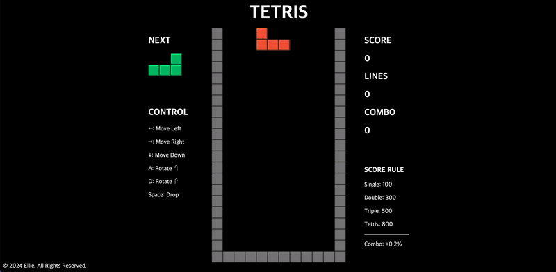

# TETRIS

고전 게임 테트리스입니다.

<a href="https://park-ssoyeon.github.io/tetris/" target="_blank">테트리스 바로 실행</a>

## 목차

1. [파일 구조 (File Structure)](#파일-구조-file-structure)
2. [예시 (Screenshot)](#예시-screenshot)
3. [기능 (Features)](#기능-features)
4. [설치 (Installation)](#설치-installation)
5. [실행 (Usage)](#실행-usage)

## 파일 구조 (File Structure)
```bash
project-root/
├── css/
│    └── style.css
├── js/
│    ├── board.js
│    ├── game.js
│    ├── gameovermodal.js
│    ├── move.js
│    ├── score.js
│    ├── tetrominos.js
│    └── utils.js
├── index.html
└── README.md
```

## 예시 (Screenshot)



## 기능 (Features)
1. 페이지가 실행되면 바로 게임이 시작됩니다.
2. 이동
  - 'A' 키가 입력되면 도형이 반시계방향으로 90도 회전합니다.
  - 'D' 키가 입력되면 도형이 시계방향으로 90도 회전합니다.
  - 왼쪽 방향키가 입력되면 왼쪽으로 한 칸 이동합니다.
  - 오른쪽 방향키가 입력되면 오른쪽으로 한 칸 이동합니다.
  - 아래쪽 방향키가 입력되면 아래쪽으로 한 칸 이동합니다.
  - 'space'가 입력되면 바닥으로 떨어집니다.
3. 점수
  - 한 번에 지운 줄의 수가 1줄일 때 100점, 2줄 300점, 3줄 500점, 4줄 800점으로 계산됩니다.
  - 연속해서 줄을 지운 경우 2combo부터 기본 점수의 0.2%가 증가하여 2combo는 기본 점수의 1.2배, 3combo는 기본 점수의 1.4배, 4combo는 기본 점수의 1.6배...로 계산됩니다.
4. 새로 생성되는 도형의 자리에 고정된 블록이 있는 경우 게임 오버됩니다.
5. 게임 오버 시 최종 점수와 지운 줄의 수가 나타나는 모달창이 생성됩니다.
6. 'Play Again' 버튼을 클릭하면 처음부터 다시 시작됩니다.

## 설치 (Installation)
```bash
git clone https://github.com/PARK-SSOYEON/tetris.git
cd tetris
```

## 실행 (Usage)
```bash
python3 -m http.server
http://localhost:8000/ //해당 링크 접속
```
